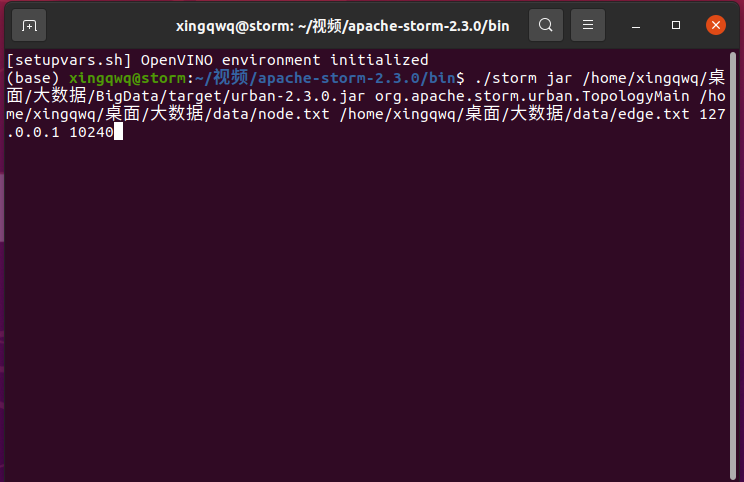

## 仓库描述
该仓库内容为HIT大数据计算基础的大作业报告和代码，我抽中的题目是城市流量黑洞检测。总体上模型难度不大，主要是storm代码挺麻烦的，本仓库的代码属于能work但不一定能work对的程度。

## 文件结构

- data：
  - server.py：数据源服务器，它会读取flow文件夹中地txt文件，然后通过TCP发送给客户端
  - flow：根据2013-10 - Citi Bike trip data.csv按照日期、时间间隔划分出来地数据
  - node：根据2013-10 - Citi Bike trip data.csv构建的节点数据
  - edge：根据2013-10 - Citi Bike trip data.csv构建的边缘数据

- BigData：基于storm的分布式城市黑洞检测
  - src：源代码
  - target：已经编译好的jar

## 运行参数

- node节点文件路径
- edge文件路径
- 数据源服务器IP地址
- 数据源服务器端口号
